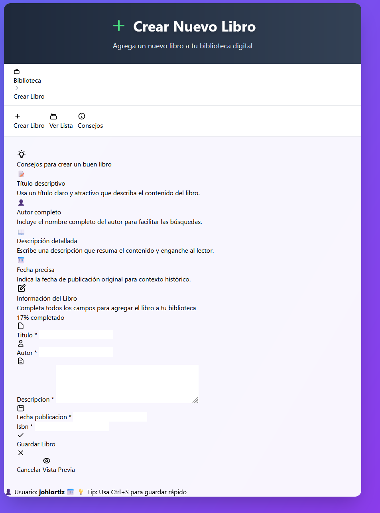
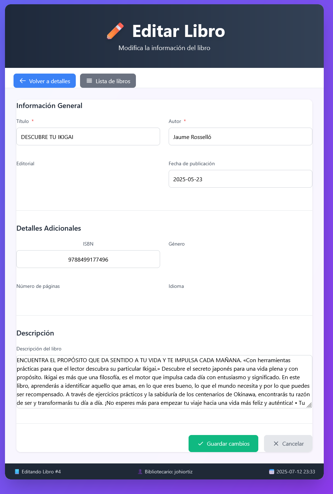

<h1 align="center"> 📖 Sistema de Gestión de Libros</h1>

<p align="center">
  
</p>

## 📋 Índice
- [📚 Descripción](#-descripción)
- [✨ Características principales](#-características-principales)
- [🛠️ Tecnologías utilizadas](#%EF%B8%8F-tecnologías-utilizadas)
- [🔒 Seguridad](#-seguridad)
- [🚀 Instalación](#-instalación)
- [📝 Uso del sistema](#-uso-del-sistema)
- [📂 Estructura del proyecto](#-estructura-del-proyecto)
- [📸 Capturas de pantalla](#-capturas-de-pantalla)
- [🌟 Características destacadas](#-características-destacadas)
- [👨‍💻 Autor](#-autor)
- [📊 Estado del proyecto](#-estado-del-proyecto)
- [🔜 Próximas mejoras](#-próximas-mejoras)

## 📚 Descripción

Un sistema completo de gestión de biblioteca digital que permite realizar operaciones CRUD (Crear, Leer, Actualizar, Eliminar) para administrar un catálogo de libros. Desarrollado con Django y diseñado con Tailwind CSS para ofrecer una experiencia de usuario moderna e intuitiva.
Este proyecto implementa una arquitectura monolítica donde todos los componentes de la aplicación (interfaz de usuario, lógica de negocio y acceso a datos) están integrados en un único sistema. A diferencia de arquitecturas basadas en microservicios, aquí todas las funcionalidades se despliegan y escalan como una unidad.
Un proyecto monolítico es un estilo de arquitectura de software donde toda la aplicación se construye como una sola unidad o bloque funcional. En este enfoque, todos los componentes de la aplicación (como la interfaz de usuario, la lógica de negocio y el acceso a datos) están estrechamente acoplados y se ejecutan en un solo proceso.

## 🔑 Características principales

- **Estructura única**: Todo el código se encuentra en un solo repositorio y se compila como una única unidad.
- **Despliegue único**: La aplicación completa se despliega de una sola vez.
- **Base de código compartida**: Todos los desarrolladores trabajan sobre la misma base de código.
- **Acoplamiento fuerte**: Los componentes están estrechamente vinculados entre sí.

## ✅ Ventajas

- **Simplicidad inicial**: Más fácil de desarrollar en las etapas iniciales.
- **Depuración sencilla**: Al estar todo integrado, es más fácil seguir el flujo de ejecución.
- **Menor complejidad operativa**: Un solo sistema para desplegar y monitorear.
- **Rendimiento**: La comunicación entre componentes es más rápida al estar en el mismo proceso.

## ⚠️ Desventajas

- **Escalabilidad limitada**: Es difícil escalar componentes individuales.
- **Tecnología homogénea**: Generalmente se utiliza un solo lenguaje/framework.
- **Mantenimiento complejo**: A medida que crece, se vuelve más difícil de mantener.
- **Despliegues arriesgados**: Cualquier cambio requiere desplegar toda la aplicación.

## 🔄 Comparación con microservicios

A diferencia de los proyectos monolíticos, la arquitectura de microservicios divide la aplicación en servicios pequeños e independientes, cada uno con su propia responsabilidad, base de código y proceso de despliegue.

| **Aspecto** | **Monolítico** | **Microservicios** |
|-------------|----------------|-------------------|
| Estructura | Una sola unidad | Múltiples servicios independientes |
| Despliegue | Toda la aplicación | Por servicio individual |
| Escalabilidad | De toda la aplicación | Por servicio según necesidad |
| Tecnología | Generalmente homogénea | Puede ser heterogénea |
| Comunicación | Llamadas a funciones internas | APIs/mensajería entre servicios |
| Desarrollo inicial | Más rápido y simple | Más complejo y costoso |
| Mantenimiento a largo plazo | Más complejo | Más manejable |

## 🏗️ Arquitectura

```
┌────────────────── Aplicación Monolítica ──────────────────┐
│                                                           │
│  ┌─────────────┐    ┌─────────────┐    ┌─────────────┐    │
│  │  Interfaz   │    │   Lógica    │    │   Acceso    │    │
│  │  de Usuario │━━━━│  de Negocio │━━━━│   a Datos   │    │
│  └─────────────┘    └─────────────┘    └─────────────┘    │
│                                                           │
└───────────────────────────────────────────────────────────┘
```


## ✨ Características principales

- **Crear libros**: Formulario interactivo con validación de datos y barra de progreso
- **Ver libros**: Listado de libros
- **Detalles de libro**: Vista detallada de cada libro con toda su información
- **Actualizar libros**: Edición completa de la información de libros existentes
- **Eliminar libros**: Eliminación segura con confirmación
- **Interfaz responsiva**: Diseño adaptable a diferentes dispositivos

## 🛠️ Tecnologías utilizadas

- **Backend**: Django 4.2.11
- **Frontend**: HTML5, CSS3, JavaScript
- **Diseño**: Tailwind CSS
- **Base de datos**: SQLite
- **Validación**: Django Forms

## 🔒 Seguridad

### Protección CSRF
El sistema implementa protección contra ataques CSRF (Cross-Site Request Forgery) utilizando tokens generados por Django:

- **¿Qué es un token CSRF?** Es un valor único y secreto que protege tu aplicación contra ataques de falsificación de solicitudes entre sitios.
- **Implementación**: Cada formulario incluye un token CSRF único que se valida en el servidor.
- **En formularios tradicionales**: Django inserta automáticamente un campo oculto con el token.
- **En solicitudes AJAX**: El token se envía en el encabezado 'X-CSRFToken'.

```javascript
// Ejemplo de implementación en JavaScript para peticiones AJAX
const csrfToken = document.querySelector('[name=csrfmiddlewaretoken]').value;

fetch('/api/libros/', {
    method: 'POST',
    headers: {
        'X-CSRFToken': csrfToken
    },
    body: formData
});
```

## 🚀 Instalación

1. Clona el repositorio:
```bash
git clone https://github.com/johiortiz/sistema-gestion-libros.git
cd sistema-gestion-libros
```

2. Crea y activa un entorno virtual:
```bash
python -m venv venv
source venv/bin/activate  # En Windows: venv\Scripts\activate
```

3. Instala las dependencias:
```bash
pip install -r requirements.txt
```

4. Realiza las migraciones:
```bash
python manage.py migrate
```

5. Inicia el servidor:
```bash
python manage.py runserver
```

6. Accede a la aplicación en tu navegador:
```
http://127.0.0.1:8000/libros/
```

## 📝 Uso del sistema

### Crear un nuevo libro

1. Accede a "Crear Libro" desde la barra de navegación
2. Completa todos los campos del formulario
3. Usa el botón "Vista Previa" para revisar la información
4. Haz clic en "Guardar Libro" para crear el registro

### Ver y gestionar libros

1. La página principal muestra el listado de todos los libros
2. Utiliza las opciones de filtrado para encontrar libros específicos
3. Haz clic en un libro para ver sus detalles
4. Usa los botones de acción para editar o eliminar

## 📂 Estructura del proyecto

```
sistema_libros/
├── libros/
│   ├── static/
│   │   ├── css/
│   │   └── js/
│   ├── templates/
│   │   └── libros/
│   │       ├── crear_libro.html
│   │       ├── detalle_libro.html
│   │       ├── editar_libro.html
│   │       ├── eliminar_libro.html
│   │       └── lista_libros.html
│   ├── models.py
│   ├── forms.py
│   ├── urls.py
│   └── views.py
├── sistema_libros/
│   ├── settings.py
│   ├── urls.py
│   └── wsgi.py
├── manage.py
└── db.sqlite3
```

## 📸 Capturas de pantalla

## Página principal - Lista de libros

<div align="center">
  
</div>

---

## Formulario de creación de libros

<div align="center">
  
</div>

---

<div align="center">
  
</div>

---
## Vista detallada de libro

<div align="center">
  
</div>

---

## Editar libro

<div align="center">
  
</div>

---

## Eliminar libro

<div align="center">
  
</div>

---

## 🌟 Características destacadas

- **Panel de consejos**: Ayuda al usuario con recomendaciones para crear registros
- **Vista previa**: Permite visualizar cómo quedará el libro antes de guardarlo
- **Validación en tiempo real**: Feedback inmediato al usuario sobre errores
- **Diseño moderno**: Interfaz atractiva con animaciones y transiciones suaves
- **Mensajes de confirmación**: Notificaciones para acciones exitosas y errores

## 👨‍💻 Autor

**Johi Ortiz** - Desarrollado como parte del Bootcamp de IA P5 de Factoria F5🟠.

📆 Fecha: 12 de julio de 2025


### 📊 Estado del proyecto

✅ Versión 1.0 completada con todas las funcionalidades CRUD implementadas.

### 🔜 Próximas mejoras

- Implementación de autenticación de usuarios
- Opciones de filtrado y búsqueda
- Categorización de libros por géneros
- Sistema de reseñas y valoraciones
- Exportación de datos a PDF/CSV
- Modo oscuro
